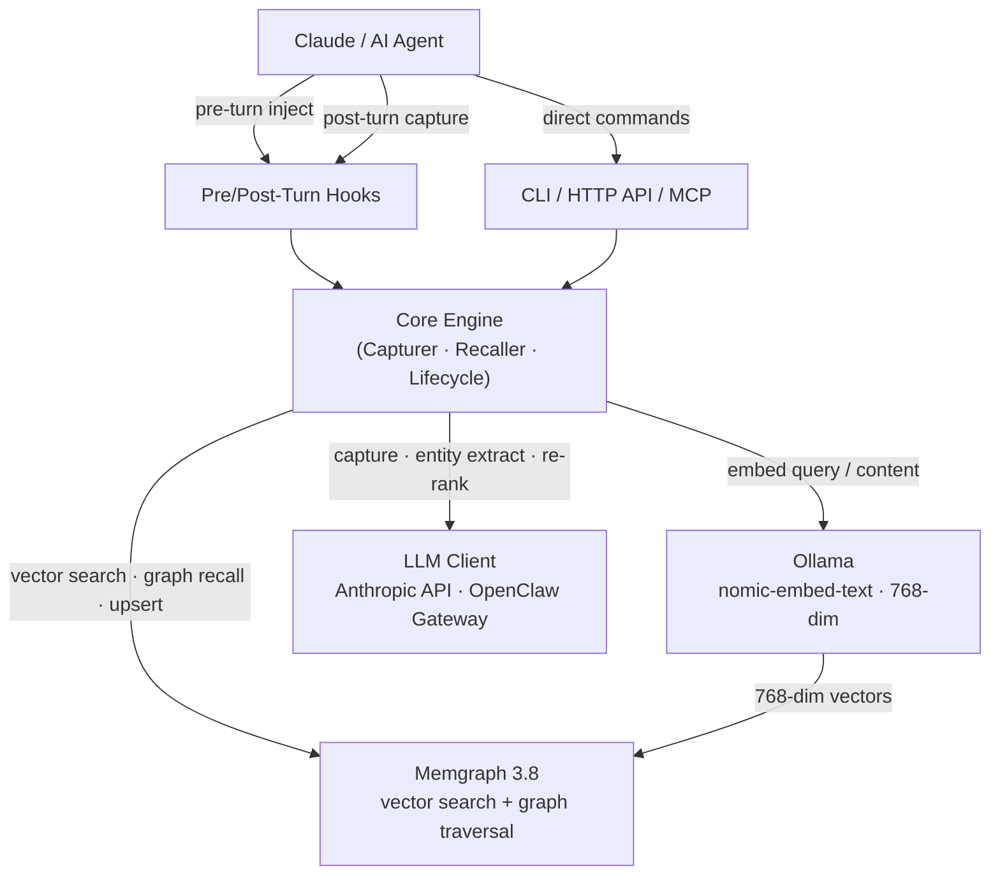

# OpenClaw Cortex

<p align="center">
  <strong>Persistent, semantically searchable memory for AI agents — across sessions, projects, and context windows.</strong>
</p>

<p align="center">
  <a href="https://go.dev/"></a>
  <a href="LICENSE"></a>
  <a href="https://github.com/ajitpratap0/openclaw-cortex/releases/tag/v0.8.0"></a>
  <a href="https://github.com/ajitpratap0/openclaw-cortex/actions/workflows/ci.yml"></a>
  <a href="https://goreportcard.com/report/github.com/ajitpratap0/openclaw-cortex"></a>
</p>

---

## What is this?

OpenClaw Cortex is a self-hosted memory layer for AI agents. It captures structured memories from conversations using Claude Haiku, stores them in Memgraph (a graph database with native vector search), and retrieves the most relevant context for each new turn — trimmed to fit your token budget.

It replaces naive conversation history with an **8-factor ranked, graph-aware recall engine** that gets smarter over time: access patterns reinforce confidence, contradictions are detected and surfaced, and outdated memories decay automatically.

---

## Features

- **Hybrid graph + vector recall** — Memgraph provides both 768-dim vector search and graph traversal in a single store; results are fused with Reciprocal Rank Fusion (RRF)
- **8-factor scoring** — similarity, recency, frequency, type boost, scope boost, confidence, reinforcement, and tag affinity — all configurable weights
- **Smart capture** — Claude Haiku extracts structured memories, entities, and relationship facts from conversation turns; prompt injection is prevented via XML escaping
- **Temporal versioning** — `valid_from`/`valid_to` on every fact; `as-of` point-in-time queries
- **Conflict detection** — contradicting memories are tagged, penalised in recall (×0.8), and resolved during consolidation
- **Confidence reinforcement** — repeated captures strengthen existing memories rather than creating duplicates (cosine dedup threshold: 0.92)
- **Memory lifecycle** — TTL expiry, session decay (24 h), and consolidation consolidate stale memories
- **Token-aware output** — recalled memories are trimmed to fit a configurable token budget before injection
- **LLM gateway support** — works with the Anthropic API directly or via the OpenClaw gateway (Max plan / subscription)
- **Claude Code hooks** — pre/post-turn hooks inject memory and capture automatically; both exit 0 even when services are unavailable
- **HTTP API + MCP server** — REST endpoints and native Model Context Protocol support for Claude Desktop and other clients
- **OpenClaw plugin** — one-command install brings auto-recall and auto-capture into the OpenClaw IDE

---

## Quick Start

**1. Install the binary**

```bash
curl -fsSL https://raw.githubusercontent.com/ajitpratap0/openclaw-cortex/main/scripts/install.sh | bash
```

Or build from source (requires Go 1.25+):

```bash
git clone https://github.com/ajitpratap0/openclaw-cortex
cd openclaw-cortex
go build -o bin/openclaw-cortex ./cmd/openclaw-cortex
```

**2. Start Memgraph**

```bash
docker compose up -d
```

The bundled `docker-compose.yml` starts a single Memgraph 3.8 instance with `--storage-properties-on-edges=true` (required for relationship fact metadata).

**3. Pull the embedding model**

```bash
ollama pull nomic-embed-text
```

**4. Store your first memory and recall it**

```bash
# Set your Anthropic API key (required for capture)
export ANTHROPIC_API_KEY=sk-...

# Store a memory directly
openclaw-cortex store "Always run tests before merging" --type rule --scope permanent

# Capture memories from a conversation turn (Claude Haiku extracts and classifies)
openclaw-cortex capture \
  --user "How should I handle errors in Go?" \
  --assistant "Always wrap errors with fmt.Errorf and %w for proper unwrapping."

# Recall relevant context within a 2000-token budget
openclaw-cortex recall "What are the testing requirements?" --budget 2000
```

---

## Architecture



**Recall call flow:**

```
recall command
  → Recaller          (multi-factor scoring + RRF graph merge)
  → Memgraph Client   (latency-budgeted graph traversal)
  → Embedder          (Ollama HTTP, nomic-embed-text)
  → Memgraph Client   (vector search)
  → tokenizer         (trim to token budget)
```

**Capture call flow:**

```
capture command
  → Capturer          (Claude Haiku: JSON memory extraction)
  → EntityExtractor   (Claude Haiku: entity recognition)
  → FactExtractor     (Claude Haiku: relationship facts)
  → Classifier        (heuristic keyword scoring → MemoryType)
  → Memgraph Client   (cosine dedup, then upsert)
```

---

## Plugin

Install the OpenClaw plugin to get automatic memory in every conversation:

```bash
openclaw plugin install memory-cortex
```

The plugin wraps pre/post-turn hooks around every agent turn. Config options:

| Option | Default | Description |
|--------|---------|-------------|
| `binaryPath` | `openclaw-cortex` (PATH) | Path to the cortex binary |
| `project` | — | Default project name for scoped memories |
| `tokenBudget` | `2000` | Token budget for auto-recall injection |
| `autoRecall` | `true` | Inject relevant memories before each turn |
| `autoCapture` | `true` | Extract memories from conversation turns |

For manual Claude Code hook setup, add to `.claude/settings.json`:

```json
{
  "hooks": {
    "PreTurn": [{"hooks": [{"type": "command", "command": "echo '{\"message\": \"{{HUMAN_TURN}}\", \"project\": \"my-project\", \"token_budget\": 2000}' | openclaw-cortex hook pre"}]}],
    "PostTurn": [{"hooks": [{"type": "command", "command": "echo '{\"user_message\": \"{{HUMAN_TURN}}\", \"assistant_message\": \"{{ASSISTANT_TURN}}\", \"session_id\": \"{{SESSION_ID}}\", \"project\": \"my-project\"}' | openclaw-cortex hook post"}]}]
  }
}
```

Both hooks exit with code 0 even when services are unavailable — Claude is never blocked.

---

## Configuration

Config is loaded from `~/.openclaw-cortex/config.yaml` with env var overrides prefixed `OPENCLAW_CORTEX_`.

```yaml
memgraph:
  uri: bolt://localhost:7687       # OPENCLAW_CORTEX_MEMGRAPH_URI
  username: ""
  password: ""

ollama:
  base_url: http://localhost:11434 # OPENCLAW_CORTEX_OLLAMA_BASE_URL
  model: nomic-embed-text

claude:
  api_key: ""                      # or ANTHROPIC_API_KEY
  # LLM gateway (OpenClaw Max plan / subscription):
  gateway_url: ""                  # http://127.0.0.1:18789/v1/chat/completions
  gateway_token: ""

memory:
  dedup_threshold: 0.92            # cosine similarity threshold for deduplication
  default_ttl_hours: 720

recall:
  weights:
    similarity:    0.35
    recency:       0.15
    frequency:     0.10
    type_boost:    0.10
    scope_boost:   0.08
    confidence:    0.10
    reinforcement: 0.07
    tag_affinity:  0.05
```

Weights must sum to `1.0` (±0.01); invalid configs fall back to defaults with a warning.

---

## CLI Commands

| Command | Description |
|---------|-------------|
| `store <text>` | Store a single memory with `--type` and `--scope` |
| `store-batch` | Batch store a JSON array of memories from stdin |
| `recall <query>` | Recall relevant memories within `--budget` tokens |
| `search <query>` | Raw vector similarity search (no re-ranking) |
| `capture` | Extract memories from a `--user` / `--assistant` conversation turn |
| `get <id>` | Fetch a memory by ID |
| `update <id>` | Update a memory (creates new version with lineage) |
| `list` | List all memories with optional filters |
| `forget <id>` | Invalidate a memory by ID |
| `index` | Walk and summarize a markdown memory directory |
| `lifecycle` | Run TTL expiry and session decay (`--dry-run` supported) |
| `consolidate` | Resolve conflicts and consolidate related memories |
| `stats` | Show memory stats and service health (`--json` for machine output) |
| `health` | Verify Memgraph, Ollama, and Claude connectivity |
| `entities` | List extracted entities and their relationships |
| `export` | Export memories to JSON |
| `import` | Import memories from JSON |
| `migrate` | Run Memgraph schema migrations |
| `serve` | Start the HTTP API server (default `:8080`) |
| `mcp` | Start the MCP server for Claude Desktop |
| `hook pre` | Pre-turn hook: recall and inject context |
| `hook post` | Post-turn hook: capture memories from a turn |
| `hook install` | Install Claude Code hooks into `.claude/settings.json` |

---

## API

**HTTP API** (`openclaw-cortex serve`, default `:8080`): REST endpoints for store, recall, search, capture, stats, entities, and health. Suitable for any LLM pipeline or agent framework. Full reference: [docs/api](https://ajitpratap0.github.io/openclaw-cortex/api/).

**MCP server** (`openclaw-cortex mcp`): Native Model Context Protocol tools — `remember`, `recall`, `forget`, `search`, `stats`, `list_entities`, and `query_facts`. Connects directly to Claude Desktop or any MCP-compatible client.

---

## Contributing

Contributions are welcome. Please read [CONTRIBUTING.md](CONTRIBUTING.md) first.

```bash
git checkout -b feat/short-description
# make changes
go test -short -race -count=1 ./...
golangci-lint run ./...
git push -u origin feat/short-description
gh pr create --title "feat: ..." --body "..."
```

Branch naming: `feat/<topic>`, `fix/<topic>`, `refactor/<topic>`, `test/<topic>`.

`main` is protected — direct pushes are blocked. All changes go through a PR. Required CI checks: `test (ubuntu-latest, 1.23)` and `test (macos-latest, 1.23)`.

---

## License

MIT — see [LICENSE](LICENSE).
